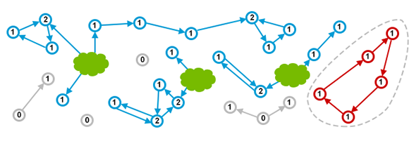

## Java垃圾收集必备手册

### 1. 垃圾收集简介

Garbage Collection - 跟踪所有正在使用的对象， 并把其余部分当做垃圾。

解决问题：Memory leakage - 分配的内存不再适用

#### 手动内存管理(Manual Memory Management)

##### 智能指针(Smart Pointers)

- 引用计数(reference counting) - 针对每个对象，记录被引用的次数，当引用计数为0时，这个对象就可以被回收(reclaimed) e.g. `std::shared_ptr`
  - `std::shared_ptr` 被用来跟踪引用的数量。作为参数传递时reference count + 1，在离开作用域时reference count - 1。 当引用计数为0时, `std::shared_ptr` 自动删除底层的对象。

#### 自动内存管理(Automated Memory Management)

##### 引用计数(Reference Counting)

C++共享指针方式, 可以应用到所有对象。许多语言都采用这种方法, 包括 Perl、Python 和 PHP 等。下图很好地展示了这种方式:


- GC ROOTS - 程序正在使用的对象，可能是当前正在执行的方法中的局部变量，或者是静态变量
- 蓝色的圆圈表示可以引用到的对象，里面的数字就是引用计数。然后灰色的圆圈是各个作用域都不再引用的对象。
- 灰色的对象被认为是垃圾。

- **问题: 循环引用(detached cycle) ** - 任何作用域都没有引用指向这些对象，但由于循环引用，导致**引用计数一只大于0**。

  

  - 红色对象实际上属于垃圾，但由于引用计数的局限，所以存在内存泄漏。
    - 应对：**弱引用(weak references)** 或只用算法来排查循环引用等。Perl、Python 和PHP 等语言, 都使用了某些方式来解决循环引用问题, 但本文不对其进行讨论。下面介绍JVM中使用的垃圾收集方法。

#### Mark and Sweep

- JVM明确定义了什么是**对象的可达性(reachability)**
- Garbage Collection Roots includes:
  - Local variables
  - Active threads
  - Static fields
  - JNI references
  - etc.

JVM使用Mark and Sweep algorithm来跟踪所有可达对象，确保所有不可达对象(non-reachable objects)占用的内存都能被重用。其中包含两步: 

- `Marking`：遍历所有可达对象，并在本地内存(native)中分门别类记下
- `Sweeping`: 这一步保证了不可达对象所占用的内存，在之后进行内存分配时可以重用

JVM中包含了多种GC算法, 如Parallel Scavenge(并行清除), Parallel Mark+Copy(并行标记+复制) 以及 CMS, 他们在实现上略有不同, 但理论上都采用了以上两个步骤。

标记清除算法最重要的优势, 就是不再因为循环引用而导致内存泄露:


而不好的地方在于, 垃圾收集过程中, **需要暂停应用程序的所有线程**。假如不暂停,则对象间的引用关系会一直不停地发生变化, 那样就没法进行统计了。这种情况叫做 **STW停顿**(**`Stop The World pause`**, 全线暂停), 让应用程序暂时停止，让JVM进行内存清理工作。有很多原因会触发 STW停顿, 其中垃圾收集是最主要的因素。

### 2. Java中的垃圾收集

#### 碎片整理(Fragmenting and Compacting)

每次执行sweeping, JVM都必须保证不可达对象占用的内存能被回收重用。但这(最终)有可能会产生内存碎片(类似于磁盘碎片)，进而引发两个问题：

- 写入操作越来越耗时，因为寻找一块足够大的空闲内存会变的非常麻烦。
- 在创建新对象时，JVM在连续的块中分配内存。如果碎片问题很严重，直至没有空闲片段能存放下新创建的对象，就会发生内存分配错误(allocation error)。

要避免这类问题，JVM必须确保碎片问题不失控。因此在垃圾收集过程中，不仅仅是标记和清除，还要执行"**内存碎片整理**" - **让可达对象(reachable objects)依次排列，以消除(或减少)碎片。**


> **说明**:
>
> JVM中的引用是一个抽象的概念,如果GC移动某个对象, 就会修改(栈和堆中)所有指向该对象的引用。
>
> 移动/拷贝/提升/压缩 是一个 STW 的过程,所以修改对象引用是一个安全的行为。但要更新所有的引用,对某些程序可能性能低下。

#### 分代假设(Generational Hypothesis)

我们前面提到过,执行垃圾收集需要停止整个应用。很明显,对象越多则收集所有垃圾消耗的时间就越长。但可不可以只处理一个较小的内存区域呢? 为了探究这种可能性,研究人员发现, 程序中的大多数可回收的内存可归为两类:

- 大部分对象很快就不再使用
- 还有一部分不会立即无用,但也不会持续(太)长时间

这些观测形成了 **弱代假设**(Weak Generational Hypothesis)。基于这一假设, VM中的内存被分为**年轻代**(Young Generation)和**老年代**(Old Generation)。老年代有时候也称为 **年老区**(Tenured)。


拆分为这样两个可清理的单独区域，允许采用不同的算法来大幅提高GC的性能。

这种方法也不是没有问题。例如，在不同分代中的对象可能会互相引用, 在收集某一个分代时就会成为 "事实上的" GC root。

当然,要着重强调的是,分代假设并不适用于所有程序。因为GC算法专门针对“要么死得快”，“否则活得长” 这类特征的对象来进行优化, JVM对收集那种存活时间半长不长的对象就显得非常尴尬了。

#### 内存池(Memory Pools)

堆内存中的内存池划分也是类似的。不太容易理解的地方在于各个内存池中的垃圾收集是如何运行的。请注意,不同的GC算法在实现细节上可能会有所不同,但和本章所介绍的相关概念都是一致的。


#### 新生代(Eden,伊甸园)

Eden 是内存中的一个区域, 用来分配新创建的对象。通常会有多个线程同时创建多个对象, 所以 Eden 区被划分为多个 **线程本地分配缓冲区**(Thread Local Allocation Buffer, 简称TLAB)。通过这种缓冲区划分,大部分对象直接由JVM 在对应线程的TLAB中分配, 避免与其他线程的同步操作。

如果 TLAB 中没有足够的内存空间, 就会在共享Eden区(shared Eden space)之中分配。如果共享Eden区也没有足够的空间, 就会触发一次 年轻代GC 来释放内存空间。如果GC之后 Eden 区依然没有足够的空闲内存区域, 则对象就会被分配到老年代空间(Old Generation)。

当 Eden 区进行垃圾收集时, GC将所有从 root 可达的对象过一遍, 并标记为存活对象。

我们曾指出,对象间可能会有跨代的引用, 所以需要一种方法来标记从其他分代中指向Eden的所有引用。这样做又会遭遇各个分代之间一遍又一遍的引用。JVM在实现时采用了一些绝招: 卡片标记(card-marking)。从本质上讲,JVM只需要记住Eden区中 “脏”对象的粗略位置, 可能有老年代的对象引用指向这部分区间。更多细节请参考: [Nitsan 的博客](http://psy-lob-saw.blogspot.com/2014/10/the-jvm-write-barrier-card-marking.html) 。


#### 活存区(Survivor Spaces)

Eden 区的旁边是两个**存活区**, 称为 `from 空间`和 `to 空间`。需要着重强调的的是, 任意时刻总有一个存活区是空的(empty)。

空的那个存活区用于在下一次年轻代GC时存放收集的对象。年轻代中所有的存活对象(包括Edenq区和非空的那个 "from" 存活区)都会被复制到 ”to“ 存活区。GC过程完成后, ”to“ 区有对象,而 'from' 区里没有对象。两者的角色进行正好切换 。


存活的对象会在两个存活区之间复制多次, 直到某些对象的存活 时间达到一定的阀值。分代理论假设, 存活超过一定时间的对象很可能会继续存活更长时间。

这类“ 年老” 的对象因此被**提升**(promoted )到老年代。提升的时候， 存活区的对象不再是复制到另一个存活区,而是迁移到老年代, 并在老年代一直驻留, 直到变为不可达对象。

为了确定一个对象是否“足够老”, 可以被提升(Promotion)到老年代，GC模块跟踪记录每个存活区对象存活的次数。每次分代GC完成后,存活对象的年龄就会增长。当年龄超过**提升阈值**(tenuring threshold), 就会被提升到老年代区域。

具体的提升阈值由JVM动态调整,但也可以用参数 `-XX:+MaxTenuringThreshold` 来指定上限。如果设置 `-XX:+MaxTenuringThreshold=0` , 则GC时存活对象不在存活区之间复制，直接提升到老年代。现代 JVM 中这个阈值默认设置为**15**个 GC周期。这也是HotSpot中的最大值。

如果存活区空间不够存放年轻代中的存活对象，提升(Promotion)也可能更早地进行。

#### 老年代(Old Generation)

老年代的GC实现要复杂得多。老年代内存空间通常会更大，里面的对象是垃圾的概率也更小。

老年代GC发生的频率比年轻代小很多。同时, 因为预期老年代中的对象大部分是存活的, 所以不再使用标记和复制(Mark and Copy)算法。而是采用移动对象的方式来实现最小化内存碎片。老年代空间的清理算法通常是建立在不同的基础上的。原则上,会执行以下这些步骤:

- 通过标志位(marked bit),标记所有通过 GC roots 可达的对象.
- 删除所有不可达对象
- 整理老年代空间中的内容，方法是将所有的存活对象复制,从老年代空间开始的地方,依次存放。

通过上面的描述可知, 老年代GC必须明确地进行整理,以避免内存碎片过多。

#### 永久代(PermGen)

在Java 8 之前有一个特殊的空间,称为“永久代”(Permanent Generation)。这是存储元数据(metadata)的地方,比如 class 信息等。此外,这个区域中也保存有其他的数据和信息, 包括 内部化的字符串(internalized strings)等等。实际上这给Java开发者造成了很多麻烦,因为很难去计算这块区域到底需要占用多少内存空间。预测失败导致的结果就是产生 [`java.lang.OutOfMemoryError: Permgen space`](https://plumbr.eu/outofmemoryerror/permgen-space) 这种形式的错误。除非 ·OutOfMemoryError· 确实是内存泄漏导致的,否则就只能增加 permgen 的大小，例如下面的示例，就是设置 permgen 最大空间为 256 MB:

```
java -XX:MaxPermSize=256m com.mycompany.MyApplication
```

#### 元数据区(Metaspace)

既然估算元数据所需空间那么复杂, Java 8直接删除了永久代(Permanent Generation)，改用 Metaspace。从此以后, Java 中很多杂七杂八的东西都放置到普通的堆内存里。

当然，像类定义(class definitions)之类的信息会被加载到 Metaspace 中。元数据区位于本地内存(native memory),不再影响到普通的Java对象。默认情况下, Metaspace的大小只受限于 Java进程可用的本地内存。这样程序就不再因为多加载了几个类/JAR包就导致 [`java.lang.OutOfMemoryError: Permgen space. `](https://plumbr.eu/outofmemoryerror/permgen-space) 。注意, 这种不受限制的空间也不是没有代价的 —— 如果 Metaspace 失控, 则可能会导致很严重的内存交换(swapping), 或者导致本地内存分配失败。

如果需要避免这种最坏情况，那么可以通过下面这样的方式来限制 Metaspace 的大小, 如 256 MB:

```
java -XX:MaxMetaspaceSize=256m com.mycompany.MyApplication
```

### 3. GC算法(基础篇)

各种垃圾收集器的实现细节虽然并不相同,但总体而言,垃圾收集器都专注于两件事情:

- 查找所有存活对象
- 抛弃其他的部分,即死对象,不再使用的对象。

第一步, 记录(census)所有的存活对象, 在垃圾收集中有一个叫做 **标记(Marking)** 的过程专门干这件事。

#### 标记可达对象(Marking Reachable Objects)

现代JVM中所有的GC算法,第一步都是找出所有存活的对象。下面的示意图对此做了最好的诠释:


首先,有一些特定的对象被指定为 **Garbage Collection Roots**(GC根元素)。包括:

- 当前正在执行的方法里的局部变量和输入参数
- 活动线程(Active threads)
- 内存中所有类的静态字段(static field)
- JNI引用

其次, GC遍历(traverses)内存中整体的对象关系图(object graph),从GC根元素开始扫描, 到直接引用，以及其他对象(通过对象的属性域)。所有GC访问到的对象都被**标记(marked)**为存活对象。

存活对象在上图中用蓝色表示。标记阶段完成后, 所有存活对象都被标记了。而其他对象(上图中灰色的数据结构)就是从GC根元素不可达的, 也就是说程序不能再使用这些不可达的对象(unreachable object)。这样的对象被认为是垃圾, GC会在接下来的阶段中清除他们。

在标记阶段有几个需要注意的点:

- 在标记阶段,**需要暂停所有应用线程**, 以遍历所有对象的引用关系。因为不暂停就没法跟踪一直在变化的引用关系图。这种情景叫做 **Stop The World pause** (**全线停顿**),而可以安全地暂停线程的点叫做安全点(safe point), 然后, JVM就可以专心执行清理工作。安全点可能有多种因素触发, 当前, GC是触发安全点最常见的原因。

  此阶段暂停的时间, 与堆内存大小,对象的总数没有直接关系, 而是由**存活对象**(alive objects)的数量来决定。所以增加堆内存的大小并不会直接影响标记阶段占用的时间。

**标记** 阶段完成后, GC进行下一步操作, 删除不可达对象。

#### 删除不可达对象(Removing Unused Objects)

各种GC算法在删除不可达对象时略有不同, 但总体可分为三类: **清除(sweeping)**、**整理(compacting)**和**复制(copying)**。

#### Sweep(清除)

**Mark and Sweep(标记-清除)** 算法的概念非常简单: 直接忽略所有的垃圾。也就是说在标记阶段完成后, 所有不可达对象占用的内存空间, 都被认为是空闲的, 因此可以用来分配新对象。

这种算法需要使用 **空闲表(free-list)**,来记录所有的空闲区域, 以及每个区域的大小。维护空闲表增加了对象分配时的开销。此外还存在另一个弱点 —— 明明还有很多空闲内存, 却可能没有一个区域的大小能够存放需要分配的对象, 从而导致分配失败(在Java 中就是 [OutOfMemoryError](http://plumbr.eu/outofmemoryerror))。


#### Compact(整理)

**标记-清除-整理算法(Mark-Sweep-Compact)**, 将所有被标记的对象(存活对象), 迁移到内存空间的起始处, 消除了标记-清除算法的缺点。 相应的缺点就是GC暂停时间会增加, 因为需要将所有对象复制到另一个地方, 然后修改指向这些对象的引用。此算法的优势也很明显, 碎片整理之后, 分配新对象就很简单, 只需要通过指针碰撞(pointer bumping)即可。使用这种算法, 内存空间剩余的容量一直是清楚的, 不会再导致内存碎片问题。


#### Copy(复制)

**标记-复制算法(Mark and Copy)** 和 标记-整理算法(Mark and Compact) 十分相似: 两者都会移动所有存活的对象。区别在于, 标记-复制算法是将内存移动到另外一个空间: 存活区。标记-复制方法的优点在于: 标记和复制可以同时进行。缺点则是需要一个额外的内存区间, 来存放所有的存活对象。


References:

https://github.com/cncounter/gc-handbook/blob/master/GC_HANDBOOK.md